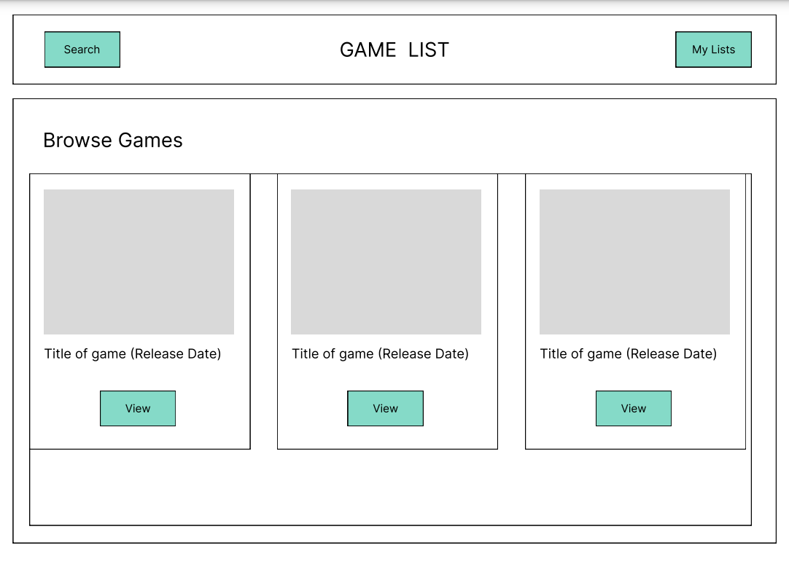

This is a [Next.js](https://nextjs.org/) project bootstrapped with [`create-next-app`](https://github.com/vercel/next.js/tree/canary/packages/create-next-app).

# GameList

I wanted to learn Next.js so this is a recreation of my final project for General Assembly JavaScript Development. The original was built using React Router.

## The App

The original challenge was to take a publicly available API and build something with it. I came across RAWG.io, which is like IMDB for games. My app is more focused on busy people who love games but don't always have time to play (say, if you're always studying). So the concept is that you can save a wishlist of games, and also a list of favourites so when you have some time to play you can pick something you already have.

I planned to have just a few pages:

- A home/search page, with a search bar. Users can type in a game title and will be redirected to...
- a search results page showing all the matches for the users search query. Users can click on a game and be taken to...
- a game details page with some basic info, description, and screenshots. From this page the user can add the game to a wishlist, or a list of favourites.
- in the navbar will be the app title and a button to go to the search page again or to the users lists page
- on the list page will be two sections, one for the wishlist at the top and then the favourites underneath.

## Design

Below are the original wireframes for the layout. It has not changed too much but let's just say I made some interesting UX choices.

Search results:  


View game:  


A mini-tour in gif form:  
  
It turned out the recommendations endpoint only returned games with similar names so I left it out for now, I'll try working on something using the tags.

## Backend

This app doesn't have a dedicated backend, lists are saved to the browsers local storage. This means not signing in to yet another app in the world.

## Routing

The original app used React Router. By using Next.js this time it means I could make use of the page router, where any file in the `pages` directory becomes a route.  
So for the search results, I created the file `pages/search/index.js` and when the user searches the route will include a URL query, passed through the router object.

Within the form submit handler:

```
  router.push( {
      pathname: '/search',
      query: {searchQuery},
    })
```

Performing a search takes the user to `/search?searchQuery=game`.

For viewing a game, I have a dynamic route using the file `[slug].js` which is routed to from the view button on a game on the search results page (or the lists page).

Within the `map` through the game objects:

```
<Link href={ {
    pathname: "/" + game.slug
} }>
    <Button className="btn btn-sm btn-primary">
        <FaEye /> View
    </Button>
</Link>
```

So if the user clicks on the game 'Prey' they are taken to '/prey'.

## WIP

### TODO

- separate back button into a component
- update route for games to /games/slug instead of /slug
- create an about page
- expand form to include filters

## Challenges

Some issues I ran into and how I solved them.

### NextJS internal server error

This was built with Next 14 but I had to downgrade to Next 13.4.8. Some issue with the update meant that any page using `getServerSideProps` with `next/head` would result in an internal server error.  
More context on this issue is on [this Netlify support forum post](https://answers.netlify.com/t/next-js-14-upgrade-results-in-500-status-code/105786/1).

### NextJS hydration error / `p` nesting

I had earlier ran into an issue where some of the game object descriptions contained HTML, which would output as text on the `[slug].js` page. I 'solved' this by using `dangerouslySetInnerHTML` within the `p` tag. Later when I moved to NextJS this caused a hydration error because the HTML data from the API would sometimes include a `p` tag resulting in nesting `p` within `p`! I got around this by using an outer `div` instead, for some games that don't have a lot of content this meant sometimes the div only contains text.  
So, first I check if the game description text contains a `p` tag, and render the `div` if it does and a normal `p` if it doesn't. I also looked around for ways to sanitise the HTML and found installed [isomorphic-dompurify](https://www.npmjs.com/package/isomorphic-dompurify).

### Accessing localStorage

Next cannot get to localStorage while rendering because it isn't on the browser yet.  
So trying to set button styles on the slug page worked on the first render (when the page is first loaded) but when refreshing the page, boom, error.  
One way around this to have a piece of state for each list and set a boolean.  
Then in the function we can check if localStorage is defined before trying to set the state in a `useEffect`.

This sets the classNames and disabled state of the button depending on if the game is already in the specified list.  
The `onClick` puts the game data into the specified list and updates the button text and colour to show the user confirmation.

```
<Button
    className={`m-1 btn btn-wide ${gameInWishlist && 'btn-success'}`}
    disabled={gameInWishlist}
    onClick={(ev) => {
        handleClick(ev,'wishlist',gameData)
    }}
    >
        {
            gameInWishlist
            ?
            <>
                <FaCheck /> In wishlist
            </>
            :
            <>
                <FaGift /> Add to wishlist
            </>
        }
</Button>
```

**The next set of changes I make will be around moving this logic for displaying buttons into a separate component.**

### Setting up hover styles only on devices that support it

I had set up an hover effect on the game cards (for search results and list pages). However, for touch devices there is no hover (the effect only appears on tap). So naturally I would like to only use those styles not on mobile devices.

One way is to set hover classes only at small screens, which kinda works but doesn't actually work for a device that is touch enabled but has a wider screen like a tablet. So really the screen size is irrelevant.

What I really need to know is simply how to detect if a device is touch enabled.  
In [this article](https://css-irl.info/detecting-hover-capable-devices/) the author talks about creating a media query based on if the device supports hover. [Hover already has it's own media query](https://developer.mozilla.org/en-US/docs/Web/CSS/@media/hover). We can add `pointer` to detect how accurate the pointer is, `fine` usually indicating a mouse (some Android devices still enable hover in the form of a long press). So putting these two together we have a media query that detects if the device is NOT touch enabled.

```
@media (hover: hover) and (pointer: fine) {
  .some-component {
    /* Styles for hover-able devices */
  }
}
```

To use this media query with Tailwind you can put it in your `tailwind.config.js`:

```
...
theme: {
    extend: {
      screens: {
        'canHover': { 'raw': '(hover: hover) and (pointer: fine)'}
      }
    },
  },
...
```

You can then use this as a conditional class with Tailwind eg. `canHover:bg-secondary`.  
Using a mobile-first approach, any hover dependant classes are only applied if the browser supports hover.

```
<div className="bg-base-100 canHover:bg-secondary canHover:hover:bg-base-100"></div>
```

On non-touch devices (that support hover) the background is `bg-secondary`. When the card is hovered, the background is `bg-base-100`.  
On touch devices, the card is `bg-base-100`, i.e. it appears as per the hover state by default and there is no change on tap.

#### Sources

- https://github.com/tailwindlabs/tailwindcss/discussions/1739
- https://tailwindcss.com/docs/screens#custom-media-queries
- https://css-irl.info/detecting-hover-capable-devices/

## Future Features

- sorting and filtering
- allow custom lists
- allow user to add notes to a game saved in their list

## Resources

- http://www.figma.com
- https://api.rawg.io/docs
- https://rawgthedocs.orels.sh/api
- https://corsproxy.io
- https://daisyui.com/docs
- https://react.daisyui.com
- https://superdesigner.co/resources/mesh-gradients
- https://png-pixel.com/
- <!-- - https://fffuel.co/llline/ -->

### Image credits

- <!-- Photo by <a href="https://unsplash.com/@lorenzoherrera?utm_content=creditCopyText&utm_medium=referral&utm_source=unsplash">Lorenzo Herrera</a> on <a href="https://unsplash.com/photos/vintage-gray-game-console-and-joystick-p0j-mE6mGo4?utm_content=creditCopyText&utm_medium=referral&utm_source=unsplash">Unsplash</a> -->
  <!-- - Photo by <a href="https://unsplash.com/@jagg?utm_content=creditCopyText&utm_medium=referral&utm_source=unsplash">Jose Gil</a> on <a href="https://unsplash.com/photos/black-xbox-one-game-controller-2pNdTBn4C7U?utm_content=creditCopyText&utm_medium=referral&utm_source=unsplash">Unsplash</a>
  -->
  <!-- - Photo by <a href="https://unsplash.com/@jagg?utm_content=creditCopyText&utm_medium=referral&utm_source=unsplash">Jose Gil</a> on <a href="https://unsplash.com/photos/black-xbox-one-game-controller-2pNdTBn4C7U?utm_content=creditCopyText&utm_medium=referral&utm_source=unsplash">Unsplash</a>
  -->
  <!-- - Photo by <a href="https://unsplash.com/@jipy32?utm_content=creditCopyText&utm_medium=referral&utm_source=unsplash">Jean-Philippe Delberghe</a> on <a href="https://unsplash.com/photos/a-close-up-of-a-white-wall-with-wavy-lines-75xPHEQBmvA?utm_content=creditCopyText&utm_medium=referral&utm_source=unsplash">Unsplash</a> -->
  <!-- - Photo by <a href="https://unsplash.com/@ingvar_erik?utm_content=creditCopyText&utm_medium=referral&utm_source=unsplash">Igor Karimov 🇺🇦</a> on <a href="https://unsplash.com/photos/white-and-black-game-controller-9AmKnNZw3GA?utm_content=creditCopyText&utm_medium=referral&utm_source=unsplash">Unsplash</a> -->
